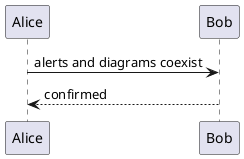
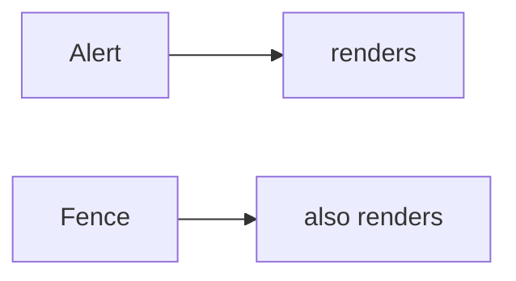

# GFM Alerts Fixture

Fixture for the markserv preview server's alert rendering. Every scenario in `openspec/specs/markdown-server-preview/spec.md` is exercised on this one page, including the two that assert nothing changed.

Serve it with the container running and `MD_DIR` set to an **absolute** path matching Neovim's cwd, then open it with `,sp`.

## The five alert types

Each must render as a titled, coloured admonition with an octicon. The literal `[!...]` marker must not appear anywhere on the page.

> [!NOTE]
> Useful information a reader should notice even when skimming.

> [!TIP]
> An optional suggestion that makes something easier.

> [!IMPORTANT]
> Crucial information needed to complete the task at hand.

> [!WARNING]
> Urgent content needing immediate attention, because ignoring it risks a bad outcome.

> [!CAUTION]
> Advice about a risk or a negative consequence of some action.

The five accent colours must be visually distinct from one another — that is the whole point of the change, since the panel category has to be legible without reading the title.

## An alert with a rich body

Alert content is ordinary markdown and must be rendered as such, not emitted as literal or pre-formatted text.

> [!IMPORTANT]
> This alert opens with a paragraph containing `inline code`, a [link to the Neovim site](https://neovim.io) and **bold text**.
>
> This is a second paragraph inside the same alert, which proves the body is not truncated at the first block.
>
> - a list item inside an alert
> - a second item, with `code` in it
> - a third
>
> ```sh
> echo "a fenced block inside an alert"
> ```
>
> And a closing paragraph, so the `:last-child` margin rule has something to act on.

## Things that must NOT change

These are the easy ones to skip, because nothing is supposed to happen.

### An unrecognised marker stays a blockquote

The marker below is not one of the five alert types. It must render as an ordinary blockquote showing its literal text, and the server must not error.

> [!EXAMPLE]
> This is not a GFM alert type, so this whole thing stays a plain blockquote.

### A plain blockquote is untouched

The blockquote below has no marker at all. It must keep the existing left border and muted grey text, and must gain no alert class and no octicon.

> An ordinary blockquote, exactly as it rendered before alert support existed.
>
> With a second paragraph, to confirm nothing about blockquote handling shifted.

### A nested blockquote

> An outer blockquote.
>
> > containing an inner one, which is also not an alert.

## Diagrams still render

Alerts are a blockquote-level construct and must not interact with the fence renderer overrides. The PlantUML block needs the `plantuml-server` container running to produce an image.





## Alerts adjacent to other constructs

> [!TIP]
> An alert immediately followed by a heading and a table, to check the `margin-bottom` does not collapse oddly against them.

| Construct | Must still work |
|---|---|
| Table | yes |
| Inline `code` | yes |
| [Link](https://neovim.io) | yes |

Ordinary paragraph text after the table, closing the fixture.
