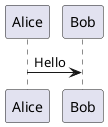

# Markdown Test Fixture

Purpose: exercise the in-editor markdown renderer and the popup float, and give indent-based folding something to actually fold. Open it in a buffer to see live rendering, or press `,pp` / run `:MarkdownPopup` to see it in the float. Every prose paragraph here is deliberately a **single long line** — the renderer wraps at display time, so hard-wrapped source would defeat the thing being tested.

## Wrapping and reflow

This paragraph exists to be long. It should wrap to the window width with every line filled before it breaks, and no single word should ever be stranded alone on a line — that was the defect that caused glow to be replaced, and it appeared at essentially every width. Resize the window with the popup open and this text should re-wrap to the new width rather than keeping its original line breaks, which is behaviour pre-rendered output can never provide.

Short paragraph, for contrast.

## Inline formatting

Plain text, then **bold**, then _italic_, then **_bold italic_**, then ~~strikethrough~~, then `inline code`, then a [link](https://neovim.io), then a bare URL: https://github.com/MeanderingProgrammer/render-markdown.nvim

Inline code with awkward content: `min(0.7 * columns, 120)`, `<leader>?`, `:MarkdownPopup`, `vim.wo[win].linebreak = true`

## Headings at every level

### Level three

#### Level four

##### Level five

## Nested lists — folding fixture

Markdown folding here uses the **indent** provider (see `lua/plugins/ufo.lua`), so folds come from indentation, not from headings. These nested lists are what `zM` and `zR` act on.

- Top level item one
  - Second level under one
    - Third level under one
      - Fourth level, deliberately deep
  - Another second level
- Top level item two
  - Second level under two
    - Third level with a longer piece of text so it wraps when the window is narrow enough to force it
- Top level item three

1. Ordered item one
   1. Nested ordered
      1. Deeper nested ordered
2. Ordered item two
   - Mixed unordered child
3. Ordered item three

## Task lists

- [ ] Unchecked task
- [x] Checked task
  - [ ] Nested unchecked
  - [x] Nested checked

## Tables

A narrow table, comfortably inside the float:

| Key | Action |
|-----|--------|
| `q` | Close the float |
| `<Esc>` | Close the float |
| `,pp` | Force the popup |

A table at the width of a real cheatsheet row (~82 columns), which should still fit the 120-column float:

| Keys | Mode | Action |
|------|------|--------|
| `Ctrl-n` | Insert / Cmdline | Open menu when closed; next suggestion when open |
| `Ctrl-y` | Insert / Cmdline | Accept highlighted suggestion (or the top one) |

A deliberately **over-wide** table, wider than the float. This one is expected to wrap — Vim cannot wrap prose and scroll tables in the same window, and correct prose wrapping is the priority. Seeing it wrap here is the documented trade-off, not a bug:

| Column One Heading | Column Two Heading | Column Three Heading | Column Four Heading | Column Five Heading | Column Six Heading |
|---|---|---|---|---|---|
| first value here | second value here | third value here | fourth value here | fifth value here | sixth value here |

## Code blocks

Lua, which should be syntax highlighted:

```lua
local function open_float(lines, what)
  local buf = vim.api.nvim_create_buf(false, true)
  vim.api.nvim_buf_set_lines(buf, 0, -1, false, lines)
  -- filetype AFTER nvim_open_win, or the renderer never attaches
  vim.bo[buf].filetype = "markdown"
  return buf
end
```

Shell:

```sh
docker compose -f ~/.config/nvim/docker/markserv/docker-compose.yml up -d
```

PlantUML in a fence renders as a **code block, not a diagram** — diagrams are the browser preview's job via `mkdp_preview_options.plantuml_server`. This is unchanged from glow, which also showed it as text:



A fence with no language, which should stay plain:

```
no language tag
  indented line inside a fence
```

## Blockquotes

> A single-level blockquote, written as one long line so it wraps like ordinary prose rather than being pre-broken by hand.
>
> > A nested blockquote inside the first.

## Horizontal rule

---

## What to check

| Check | Expected |
|-------|----------|
| Prose wrapping | Lines filled to the width; no orphaned single words |
| Reflow | Resize with the popup open; text re-wraps |
| Headings | Visually distinct at each level |
| Tables | Column structure visible, not raw pipes |
| Over-wide table | Wraps — documented trade-off |
| Code fences | Language-highlighted; plain fence stays plain |
| Task lists | Checkboxes rendered |
| `zM` / `zR` | Nested lists fold and unfold |
| `q` / `<Esc>` | Float closes, focus returns |
